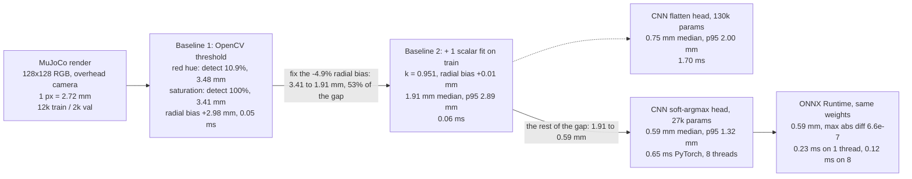

# mujoco-cube-pose-cnn

Block 1 of the CPU-only Physical AI track. **Skills: PyTorch basics · dataset creation · classical CV baseline.**

Estimate the planar pose `(x, y, yaw)` of a cube on a table from a single 128x128 RGB
image rendered in MuJoCo, and answer one question with numbers:

> When does a learned model beat hand-written geometry, and when does it not?

**Walkthrough:** https://aungkaung1928.github.io/projects/cube-pose-cnn.html — the same project explained end to end, file by file.

## At a glance

Pipeline with the measured error at each stage. All numbers: `hard` regime (random hue, light, table shade), `val` split, n=2000, median xy error unless stated.



### Results

| method | params | regime | detect | median xy | p95 xy | median yaw | p95 yaw | latency |
|---|---|---|---|---|---|---|---|---|
| OpenCV, fixed red hue | 0 | `hard` | **10.9%** | 3.48 mm | 6.07 | 0.19 deg | 1.24 | 0.06 ms |
| OpenCV, saturation | 0 | `hard` | 100% | 3.41 mm | 5.57 | 0.19 deg | 1.66 | 0.05 ms |
| **v2** OpenCV + 1 calibrated scalar | 1 | `hard` | 100% | 1.91 mm | 2.89 | 0.19 deg | 1.66 | 0.06 ms |
| CNN, flatten head | 130k | `hard` | 100% | 0.75 mm | 2.00 | 0.28 deg | 0.94 | 1.70 ms |
| CNN, soft-argmax head | **27k** | `hard` | 100% | **0.59 mm** | **1.32** | 0.21 deg | **0.66** | 0.65 ms |
| same, ONNX Runtime, 1 thread | 27k | `hard` | 100% | 0.59 mm | 1.32 | 0.21 deg | 0.66 | **0.23 ms** |
| same, ONNX Runtime, 8 threads | 27k | `hard` | 100% | 0.59 mm | 1.32 | 0.21 deg | 0.66 | **0.12 ms** |

Full table with the `easy` regime and radial-bias column is in the Results section below.

### Key points

- **A wrong prior fails silently; a better prior fixes it.** "The cube is red" detects only 10.9% of `hard` while its error on the survivors looks unchanged (3.48 mm); swapping to "most saturated thing on a near-grey table" detects 100% at 3.41 mm, so robustness to appearance randomisation was free and classical — it is not what justified the CNN.
- **Half the CNN's apparent win was calibration, not perception.** The v1 baseline carried a systematic +2.98 mm radial bias (an overhead camera sees the cube's side walls); one scalar `k = 0.951` fit on the train split removes it and takes the baseline from 3.41 mm to 1.91 mm — 53% of the gap to the CNN, closed by a single number.
- **The CNN wins the tail, not the median.** The calibrated baseline's median yaw error (0.19 deg) is slightly better than the CNN's (0.21 deg), but its p95 is 1.66 deg against 0.66 deg and p95 position is 2.89 mm against 1.32 mm — the classical method fails rarely and badly, the network never and mildly.
- **The architectural prior beat the parameter count.** The spatial soft-argmax head (27k params, 0.65 ms) reaches 0.59 mm with a better tail than the generic flatten head (130k params, 1.70 ms, 0.75 mm) — 5x smaller, 2.6x faster, more accurate.
- **The runtime mattered more than the model, and classical is still faster.** Identical weights (max abs diff `6.6e-7`) run at 0.65 ms in PyTorch eager on 8 threads, 0.23 ms in ONNX Runtime on one thread and 0.12 ms on eight; the OpenCV baseline still needs only 0.06 ms, so its speed advantage shrinks from 11x to 3.8x — if 1.9 mm is inside tolerance, the CNN is the wrong engineering choice.

## Setup

From a fresh clone. CPU-only throughout; there is no CUDA in this project.

```bash
git clone https://github.com/AungKaung1928/mujoco-cube-pose-cnn.git
cd mujoco-cube-pose-cnn
python3 -m venv .venv && . .venv/bin/activate
pip install -r requirements.txt
```

Check any row without retraining:

```bash
./verify.sh
```

`verify.sh` defaults `MUJOCO_GL` to `glfw` and pins the thread count, because
both change the numbers. Override either if your machine wants a different
rendering backend.

Tier 1 is `test_common.py` — the yaw fold, the projection and the metric checked
against values derived on paper, no data needed. Tiers 2–3 need `data/` (~30 s to
regenerate) and re-score the tracked checkpoints (`runs/*/final.pt`) through PyTorch
and ONNX Runtime.

<details><summary><b>Steps and the val-selection correction</b></summary>

## Steps

- [x] **1. Data.** `gen_dataset.py` renders randomised scenes and writes labels straight
      from the simulator state. `view_dataset.py` draws the labels back onto the images
      through the analytic overhead projection — if the markers miss the cubes, the label
      convention is wrong and nothing downstream means anything.
- [x] **2. Classical baseline.** `baseline_cv.py`: HSV threshold -> morphological open ->
      largest contour -> centroid + `minAreaRect`. Two different hand-written thresholds,
      so that "classical CV fails" cannot be blamed on one badly chosen prior.
- [x] **3. CNN regression.** `model.py` + `train.py`. One conv trunk, two heads: a generic
      flatten head, and a spatial soft-argmax keypoint head. CPU only, ~4 min per run.
- [x] **4. Fair baseline.** `baseline_v2.py` refits the classical method with one scalar
      calibrated on the *train* split, so both methods have seen the same labels.
- [x] **5. ONNX export.** `export_onnx.py` exports, then *proves* the export: max abs
      output diff vs PyTorch, plus the full task metrics recomputed through
      `onnxruntime`. A graph can be numerically close and still have a wrong output
      order or a dropped layer, so the file existing is not the finish line.

Block 1 complete. Every row below is a measurement, not an estimate.

**Correction, 2026-09-06.** The first version of `train.py` kept the epoch with the
lowest *val* error and reported that epoch's val numbers — a small leak: the split
you select on cannot also be the split you report on. Two of the three runs had
already settled on the final epoch (40), so their numbers are unchanged. The third
(`easy` / soft-argmax, which had picked epoch 38) was retrained with the fixed
script, which reports the **final** epoch and selects on nothing; its row below is
the new number — 0.48 mm against 0.47 before, so the leak cost nothing measurable,
which is the point of checking rather than assuming. Block 2 took the lesson further and holds out a tune split from
*train* so val is touched exactly once.

</details>

<details><summary><b>Task definition — regimes, yaw convention, pixel floor</b></summary>

Two dataset regimes, one model, one classical baseline, four measurements.

| regime | appearance | expectation |
|---|---|---|
| `easy` | fixed cube colour, fixed light | colour-threshold baseline should win or tie |
| `hard` | random cube hue, random light position and intensity, random table shade | baseline should degrade, CNN should not |

## Task definition

- **Position** `(x, y)` in metres, cube centre, table frame. Sampled in `+-0.075 m`.
- **Yaw** is only observable **modulo 90 degrees** — a square top face looks identical at
  5 deg and 95 deg. So the network predicts `(sin 4t, cos 4t)`, not degrees. Regressing raw
  degrees puts a discontinuity at the range boundary and the model learns to hedge in the
  middle of it. `minAreaRect` has exactly the same ambiguity, so both methods are scored
  under the same convention.
- **Camera** is overhead and parallel to the table, so pixel <-> world is exactly affine:
  `367.9 px/m`, i.e. **1 px = 2.72 mm**.

**Correction to an earlier claim in this file.** 2.72 mm/px was written down as a hard
floor. It is not. It bounds a *single-pixel* measurement; the cube covers roughly 480
silhouette pixels, and averaging over them shrinks the quantisation term by about
`sqrt(N)` — a ~0.12 mm aggregate floor, not 2.72 mm. Both the calibrated baseline
(1.91 mm) and the CNN (0.59 mm) legitimately sit below one pixel. Sub-pixel accuracy from
a many-pixel object is expected, not a bug. Reasoning about a floor from the wrong unit of
measurement is how a real result gets thrown away as an error.

</details>

<details><summary><b>Results — full table, both regimes</b></summary>

## Results

`val` split, n=2000, independent seed stream. All rows scored by the same
`common.pose_metrics`, so the numbers are directly comparable.

| method | params | regime | detect | median xy | p95 xy | median yaw | p95 yaw | radial bias | latency |
|---|---|---|---|---|---|---|---|---|---|
| OpenCV, fixed red hue | 0 | `hard` | **10.9%** | 3.48 mm | 6.07 | 0.19 deg | 1.24 | +2.96 mm | 0.06 ms |
| OpenCV, saturation | 0 | `easy` | 100% | 3.54 mm | 5.54 | 0.18 deg | 1.50 | +3.01 mm | 0.05 ms |
| OpenCV, saturation | 0 | `hard` | 100% | 3.41 mm | 5.57 | 0.19 deg | 1.66 | +2.98 mm | 0.05 ms |
| **v2** OpenCV + 1 calibrated scalar | 1 | `easy` | 100% | 1.94 mm | 2.84 | 0.18 deg | 1.50 | +0.16 mm | 0.04 ms |
| **v2** OpenCV + 1 calibrated scalar | 1 | `hard` | 100% | 1.91 mm | 2.89 | 0.19 deg | 1.66 | +0.01 mm | 0.06 ms |
| CNN, flatten head | 130k | `hard` | 100% | 0.75 mm | 2.00 | 0.28 deg | 0.94 | +0.05 mm | 1.70 ms |
| CNN, soft-argmax head | **27k** | `easy` | 100% | 0.48 mm | 1.04 | 0.16 deg | 0.51 | -0.01 mm | 0.65 ms |
| CNN, soft-argmax head | **27k** | `hard` | 100% | **0.59 mm** | **1.32** | 0.21 deg | **0.66** | -0.02 mm | 0.65 ms |
| same, ONNX Runtime, 1 thread | 27k | `hard` | 100% | 0.59 mm | 1.32 | 0.21 deg | 0.66 | -0.02 mm | **0.23 ms** |
| same, ONNX Runtime, 8 threads | 27k | `hard` | 100% | 0.59 mm | 1.32 | 0.21 deg | 0.66 | -0.02 mm | **0.12 ms** |

Training: 12000 images, 40 epochs, AdamW 2e-3 cosine, batch 64, no augmentation,
8 CPU threads, ~4 minutes per run.

</details>

<details><summary><b>What the numbers actually say</b></summary>

## What the numbers actually say

**1. A wrong prior fails silently, and its own metric hides it.** "The cube is red"
misses 89% of `hard` while its accuracy on the surviving 11% looks unchanged.
Detection rate and accuracy must always be reported together or the failure is
invisible.

**2. Robustness to appearance randomisation was free, and classical.** Swapping to
"most saturated thing on a near-grey table" gives 100% detection on `hard` with the
same error as `easy`. So domain randomisation robustness is **not** what justified
the CNN here. Picking a better hand-written feature was cheaper and it worked.

**3. Half the CNN's apparent win was calibration, not perception.** The v1 baseline
was dominated by a *systematic* +2.98 mm radial bias — an overhead camera sees the
cube's outward-facing side walls, so the silhouette centroid sits outside the true
projected centre. Fitting one scalar on the train split (`k = 0.951`, a -4.9% radial
correction) removes the bias entirely and takes the baseline from 3.41 mm to
**1.91 mm**. That is 53% of the gap to the CNN, closed by a single number and no
network. **Building the strong baseline second would have inflated the CNN's result
by 2x.**

**4. What the CNN genuinely wins is the tail.** After calibration the baseline's
*median* yaw error (0.19 deg) is actually slightly better than the CNN's (0.21 deg) —
`minAreaRect` is near-exact when the mask is clean. But its p95 is 1.66 deg against
the CNN's 0.66 deg, and p95 position is 2.89 mm against 1.32 mm. The classical method
fails rarely and badly; the network fails never and mildly. For anything that feeds a
controller, the tail is the number that matters, not the median.

**5. The architectural prior beat the parameter count.** The generic flatten head
(130k params, 1.70 ms) reaches 0.75 mm. The spatial soft-argmax head (27k params,
0.65 ms) reaches 0.59 mm with a better tail — **5x smaller, 2.6x faster, and more
accurate.** Soft-argmax computes the expected pixel coordinate of each feature
channel, so a coordinate is handed to the network instead of being learned from a
flattened grid. This is the keypoint front-end used by visuomotor policies, and this
is the measurement of why.

**6. The classical method is still 11x faster.** 0.06 ms against 0.65 ms per image.
If 1.9 mm is inside tolerance, the CNN is the wrong engineering choice regardless of
being three times more accurate.

**7. The runtime mattered more than the model.** Identical weights, identical outputs
(max abs diff `6.6e-7`, task metrics unchanged to two decimals): PyTorch eager needs
0.65 ms on 8 threads, ONNX Runtime needs **0.23 ms on one thread** and 0.12 ms on
eight. That is ~2.8x faster on one eighth of the cores. Nothing about the network
changed — only the execution engine. Before optimising an architecture for edge
latency, check whether the framework is the cost. Here it was most of it.

With that, the classical method's speed advantage shrinks from 11x to 3.8x
(0.06 ms vs 0.23 ms, both single-threaded), and a 116 KB ONNX file at 0.23 ms is a
real deployment target for a C++ ROS 2 node.

</details>

<details><summary><b>Measured environment and the ONNX export gotcha</b></summary>

## Measured environment

Intel Core Ultra 5 225H, 14 cores, no GPU, WSL2, software OpenGL (llvmpipe).
Rendering is **not** the bottleneck: 900-1080 img/s at 128 px, so 12k images takes ~12 s.
Training runs at ~1750 img/s on 8 threads, decaying to ~1300 img/s (-25 to -35%) in the
second half of a 40-epoch run — the CPU hitting its sustained power limit. WSL exposes no
temperature sensor, so `train.py` prints per-epoch throughput and flags a >20% sustained
drop as the only available throttling signal.

## Environment gotcha

`torch.onnx.export` on torch 2.14 defaults to the dynamo exporter, which imports
`onnxscript` and fails if it is absent. Passing `dynamo=False` uses the TorchScript
exporter and needs no extra dependency. Worth knowing before adding a package to a
locked-down machine for no reason.

</details>
